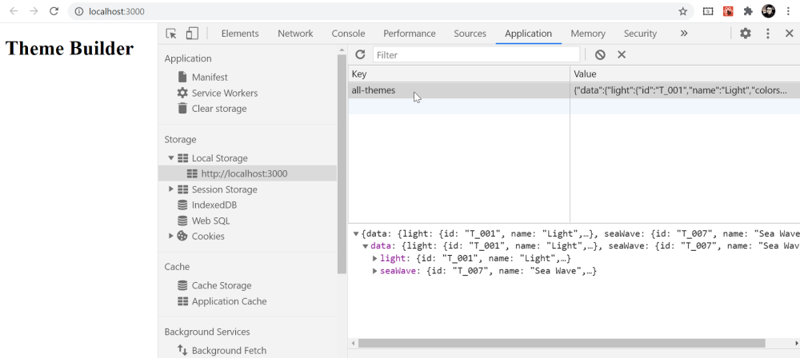
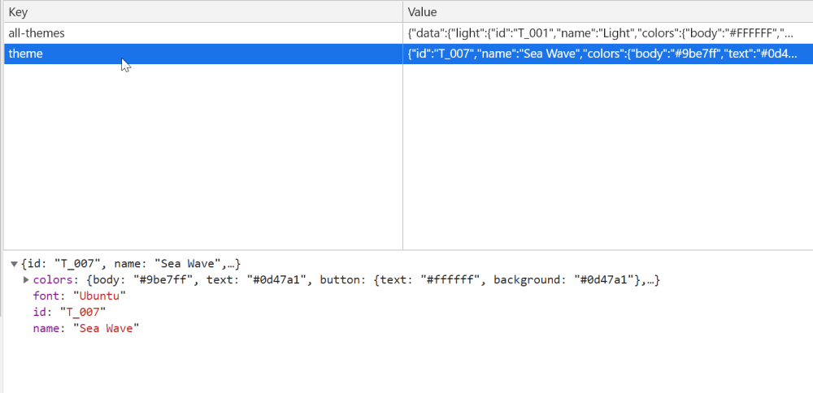

## Getting Started with Create React App and Setup

This project was bootstrapped with [Create React App](https://github.com/facebook/create-react-app).

Open a command prompt and use this command to create the project:
### `npx create-react-app theme-builder`

In the project directory, you can run:

### `yarn start`

Runs the app in the development mode.\
Open [http://localhost:3000](http://localhost:3000) to view it in the browser.

We have to install a few dependencies for our app. So let’s install those while we’re at it:

### `yarn add styled-components webfontloader lodash shortid`

Here's what we we get:
- styled-components: A flexible way to style React components with CSS. It provides out-of-the-box [theming support](https://styled-components.com/docs/advanced#theming) using a wrapper component called, `<ThemeProvider>`. This component is responsible for providing the theme to all other React components that are wrapped within it. We will see this in action in a minute.
- Web Font Loader: The [Web Font Loader](https://www.npmjs.com/package/webfontloader) helps load fonts from various sources, like Google Fonts, Adobe Fonts, etc. We will use this library to load fonts when a theme is applied.
- lodash: This is a JavaScript utility library for [some handy little extras](https://lodash.com/).

## Create and save multiple themes
We define multiple themes with these properties:
- unique identifier
- theme name
- color definitions
- fonts

and save in `src/theme/schema.json`

We are getting the theme information from the `schema.json` file and adding it to the `localStorage` using the key `all-themes`. You can use DevTools in the browser to see the themes are loaded into `localStorage`.

## Select and apply a theme
We can now use the theme structure and supply the theme object to the `<ThemeProvider>` wrapper.

First, we will create a [custom React hook](https://reactjs.org/docs/hooks-intro.html). This will manage the selected theme, knowing if a theme is loaded correctly or has any issues. Let’s start with a new `useTheme.js` file inside the `src/theme` folder.

It would be a good idea to use global styles to control things, like the site’s background color, font, button, etc. styled-components provides a component called, `createGlobalStyle` that establishes theme-aware global components. Let’s set those up in a file called, `GlobalStyles.js` in the `src/theme` folder.

A few things are happening in th `App.js`:

1. We import the `useState` and `useEffect` React hooks which will help us to keep track of any of the state variables and their changes due to any side effects. We import `ThemeProvider` and `styled` from styled-components. The `WebFont` is also imported to load fonts. We also import the custom theme, `useTheme`, and the global style component, `GlobalStyles`.

1. We create a `Container` component using the CSS styles and `styled` component.

1. We declare the state variables and look out for the changes.

1. We load all the fonts that are required by the app.

1. We render a bunch of text and a link. But notice that we are wrapping the entire content with the `<ThemeProvider>` wrapper which takes the selected theme as a prop. We also pass in the `<GlobalStyles/>` component.

## Switch themes

Next up, let’s create a file called `ThemeSelector.js` in our the `src` folder to establish our theme switcher, which we need to import in `App.js` and use it inside the `Container` component.

The fun part is, you can add as many as themes in the `schema.json` file to load them in the UI and switch. Please note, we are also saving the applied theme information in `localStorage`, so the selection will be retained when you reopen the app next time.

## Customize a theme

We give the user the ability to define the theme props themselves! We can create a simple user interface that allows users to select the appearance options they want, and even save their preferences.

The main source file for theme creation is `CreateThemeContent.js` and it is used by `App.js`.